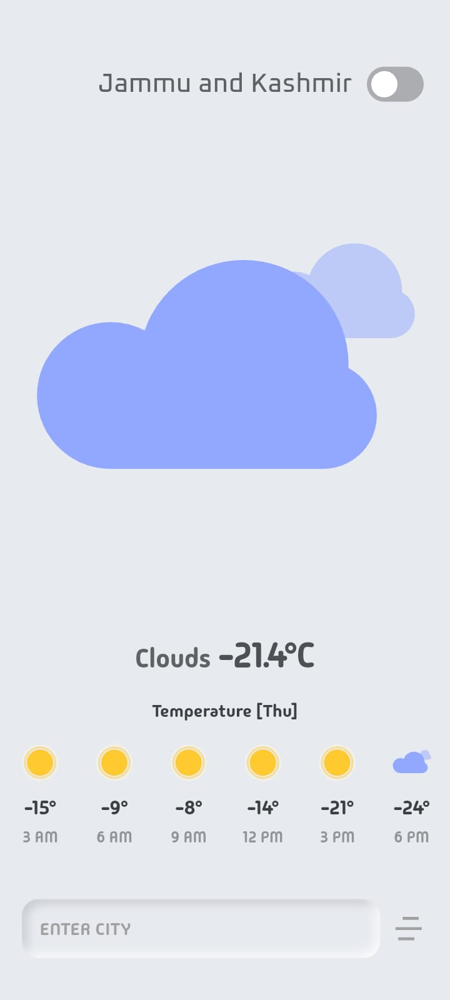
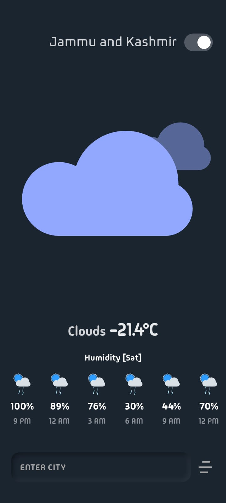
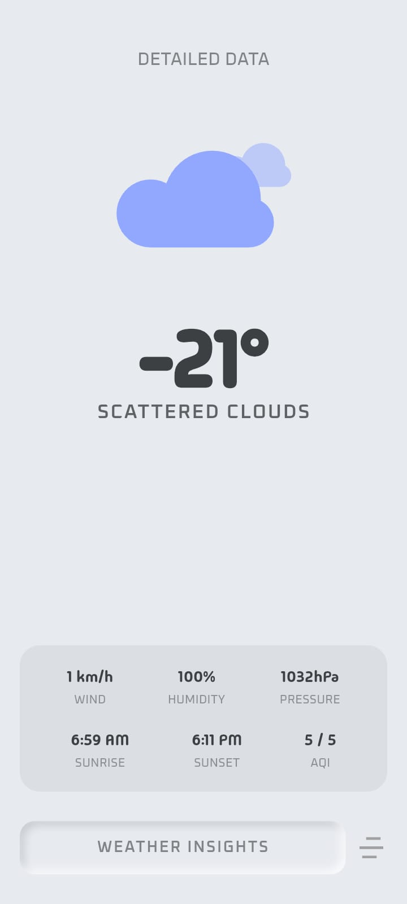
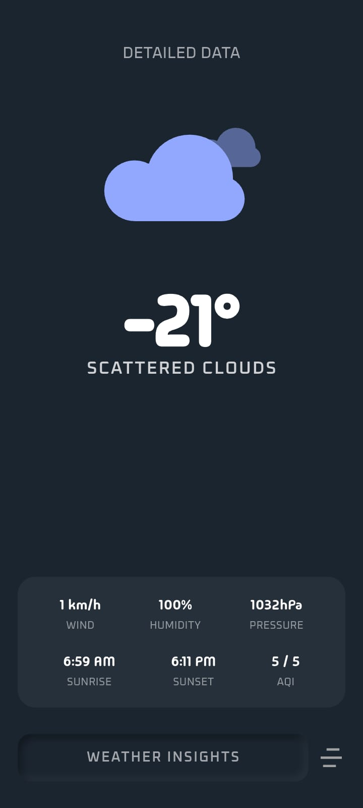

# MyWeatherApp 🌤️

A beautiful and responsive Flutter weather application that provides real-time weather updates and 5-day forecasts. The app features dynamic animated backgrounds using Lottie based on the current weather conditions.

## Features ✨

- **Real-time Weather Data**: Current temperature, wind speed, humidity, and more.
- **5-Day / 3-Hour Forecast**: Detailed forecast scrollable by hour and day.
- **Interactive Data Cards**: Swipe vertically to switch between **Temperature**, **Wind Speed**, and **Humidity**.
- **Dynamic Header System**: Context-aware header that updates to show the specific Day (e.g., "Temperature [Tue]") as you scroll through the forecast.
- **Dynamic Animations**: Beautiful Lottie animations that change based on weather conditions (Sunny, Cloudy, Rainy, Thunder, Windy).
- **Responsive Design**: Built with `flutter_screenutil` to look great on all device sizes.
- **Custom UI**: Glassmorphism effects and custom fonts (MadimiOne, Oxanium).

## Design Workflow 🎨

This project followed a structured design-to-development process:
1.  **Prototyping**: The entire UI/UX was first designed and prototyped in **Figma** to ensure a seamless user experience.
2.  **Implementation**: The design was then pixel-perfectly translated into **Flutter** code.

## Screenshots 📸

<p align="center">
  
  
  <br />
  
  
</p>

## Tech Stack 🛠️

- **Framework**: Flutter
- **Language**: Dart
- **State Management**: `setState` (Simple & Effective)
- **Networking**: `http`
- **Animations**: `lottie`
- **Responsiveness**: `flutter_screenutil`
- **Icons**: `flutter_svg`, `cupertino_icons`
- **Environment**: `flutter_dotenv`

## Project Structure 📂

```
lib/
├── core/           # Core utilities and helpers
├── models/         # Data models for parsing API responses
├── presentation/   # UI Screens (Home Screen)
├── widgets/        # Reusable UI components
└── main.dart       # Entry point of the application
```

## Getting Started 🚀

Follow these steps to set up the project locally.

### Prerequisites

- Flutter SDK installed.
- An API Key (likely from OpenWeatherMap or similar service, check the code for the specific provider).

### Installation

1.  **Clone the repository**:

    ```bash
    git clone https://github.com/milanrnw/WEATHER_TEST.git
    cd myweatherapp
    ```

2.  **Install dependencies**:

    ```bash
    flutter pub get
    ```

3.  **Environment Setup**:

    Create a `.env` file in the root directory and add your API credentials:

    ```env
    API_KEY=your_api_key_here
    # Add other required environment variables if any
    ```

4.  **Run the App**:

    ```bash
    flutter run
    ```

## Acknowledgments 🙌

- Weather data provided by [Your Weather API Provider].
- Lottie animations from [LottieFiles](https://lottiefiles.com/).
